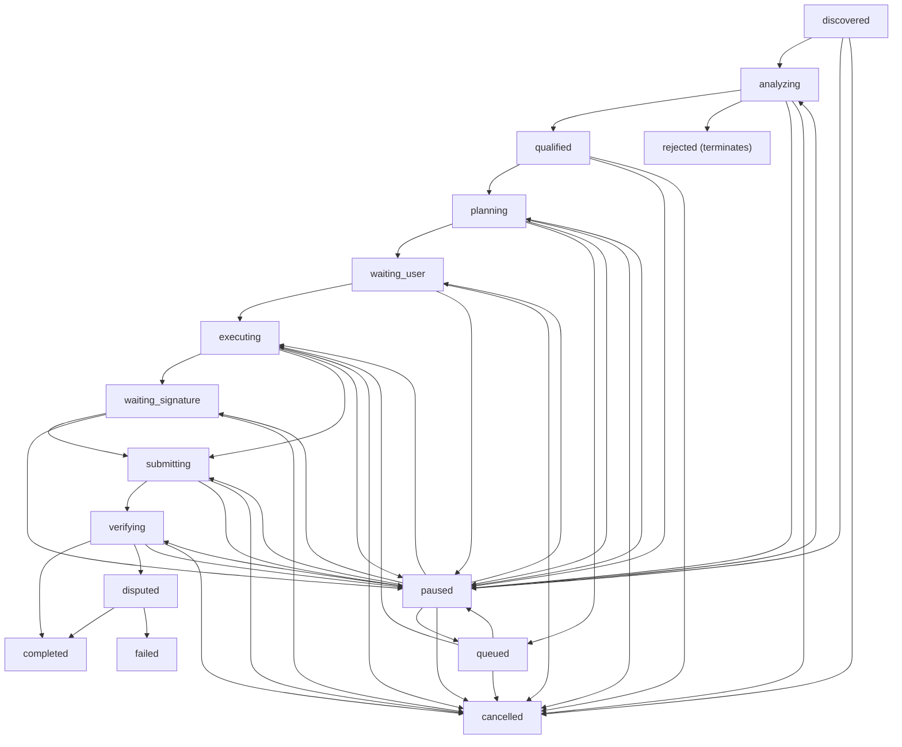

# Agent Workflow V1 (State Machine) (Legacy / Superseded)

> Status: legacy. Replaced by [GBot Canonical V1](./GBOT_CANONICAL_V1.md) and the real-asset runtime docs.

This document is preserved for historical reference only.

The GrowthBot task execution workflow is modeled as a persistent, step-by-step state machine. It runs synchronously during an HTTP request cycle (not via background queues), driving steps forward until a pause point or terminal state is reached. All state is persisted in D1 and can be resumed safely across requests.

## State Transitions Whitelist

All state transitions must go through the centralized `transitionWorkRun()` function. It enforces the whitelist below; any invalid transition throws an error.



### Terminal States

Once a work run enters `completed`, `failed`, or `cancelled`, it **cannot** transition to any other status. Any attempt to modify a terminal run's state will throw a transition error.

### Retry from `failed`

A `failed` run can be retried via the `/work-runs/:runId/retry-step` endpoint. This resets the failed step to `pending` and changes the run status to `executing`, then re-drives the workflow.

## Pause & Recovery

- **Pause Action**: Any non-terminal run can be paused. The previous status is stored as `PAUSED_FROM:<status>` in the `failed_reason` field.
- **Resume Action**: On resume, the stored source status is extracted and used as the recovery target. If no source status is found, a fallback heuristic checks step statuses.
- **Agent Status**: When a run is paused, the agent status is set to `idle`. On resume, it returns to `working`.

## Exact-Once Settlement Guard

To prevent double-spending or double-claiming of task rewards:

1. Settlement uses the `settled` flag (0/1) on `agent_work_runs`.
2. A single atomic UPDATE handles protection:
   ```sql
   UPDATE agent_work_runs
   SET settled = 1, settled_at = CURRENT_TIMESTAMP, settlement_ledger_id = ?
   WHERE id = ? AND settled = 0
   ```
3. If the rows affected count is 0, settlement is rejected — the run was already settled.
4. The `settlement_ledger_id` references the `point_ledger_events.id` for audit traceability.
5. The ledger INSERT itself uses `WHERE NOT EXISTS` for idempotency.

## Daily Run Restrictions

- **daily_run_count & daily_run_date**: The agent tracks task executions per UTC day.
- **UTC Reset Boundary**: Daily resets occur based on the UTC date string (`YYYY-MM-DD`). If the current date does not match `daily_run_date`, the count resets to 0.
- **daily_run_limit**: Free Scout agents default to 3 runs per day.

## Work Step Templates

Each work run consists of 8 ordered steps:
1. `analyze` – Scan task requirements
2. `qualify` – Verify agent eligibility (risk check)
3. `plan` – Generate execution plan
4. `prepare_output` – Draft the output
5. `wait_user_confirm` – Pause for user approval (requiresApproval = true)
6. `submit` – Package and record submission
7. `verify` – Run verification rules
8. `settle` – Apply energy cost and grant reward (exact-once)

## Important Notes

- The workflow engine runs **synchronously** during the HTTP request. There is no background queue consumer driving steps.
- Steps 1-4 auto-advance. Step 5 pauses the run for user approval.
- After user calls `/approve-step`, steps 6-8 auto-advance to completion.
- The `driveWorkflow()` function iterates through steps and returns when hitting a pause point, terminal state, or completion.
