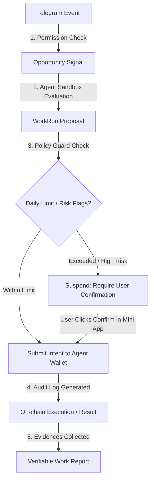

# GBot Pet Agent V2 — Real Telegram Permission Backend Plan

本设计方案旨在规划 GBot Pet Agent V2 的**授权事件接入 (Permissioned Event Ingestion)** 与后台安全权限体系。本阶段仅进行技术方案设计与文档编撰，不包含任何真实 Telegram Bot API Webhook 代码或 Agent Wallet 链上交易代码的实现。

---

## 1. V2 产品定义

GBot Pet Agent V2 的核心目标是在保障用户隐私与合规的前提下，将 Telegram 拓展为 Agent 的**授权事件接入 (Permissioned Event Ingestion)** 任务线索来源。
- **核心定义**: 所有外部信号接入必须基于显式授权、来源白名单、权限边界和安全沙箱，统一称为“授权事件接入 / Permissioned Event Ingestion”。
- **核心心智**: 宠物 Agent 仅在主人规定的围栏和命令下进行数据解析，对未授权的敏感聊天历史无读取权限。

---

## 2. Agent 与 Bot 的边界

为防止系统组件混淆，定义以下明确的技术实体边界：
- **Bot (Telegram 接入侧)**: 作为外部世界的入口与信使。负责解析 Webhook 事件，做初步的发送者/群组校验，并把过滤后的信号通过 API 传输给 GBot 后端。
- **Mini App (Agent 控制室)**: 用户的管理面板。用户在此处查看 Agent 状态、装备技能卡、配置钱包 Policy 预算、批准高风险交易 Intent，以及阅读 Verifiable Work Report。
- **Agent (执行主体)**: 用户养成的自动打工伙伴。它运行在沙箱中，接收 Ingestion Event，结合自身装备的技能卡评估机会并向 Policy Guard 发起申请。
- **Policy Guard (安全合规与风险审查层)**: 核心门禁系统。拦截所有资产动作和外部调用，匹配限额与黑白名单，若为高风险操作则进入挂起状态，强制要求主人在 Mini App 内二次点击确认。
- **Work Report (证据与结果层)**: Agent 外出探索带回的最终交付件，包含所有调用痕迹与结果链接，需任务方审核验收。

---

## 3. Telegram 数据边界

系统执行严格的最小可用性（Least Privilege）原则：

### 可处理数据 (In-scope Data)
- **显式 @GBot 提及**: 仅在群聊中出现 `@username_bot` 的消息。
- **Bot 明确命令**: 用户在私聊或授权群组内主动键入的 `/commands` 交互。
- **管理员配置的群组来源**: 仅处理群管理员主动授权且绑定的白名单群组内的公开线索。
- **用户显式提交内容**: 用户在 Mini App 或对话框中直接发送给 Bot 用于诊断或提交的文本。
- **公开可访问数据**: 公开频道或公开链接中的公告与任务线索，不违反平台访问限制。

### 绝不可处理数据 (Out-of-scope Data)
- ❌ **群组普通聊天历史**: 不读取无 `@` 提及的成员闲聊记录。
- ❌ **私聊历史监控**: 绝不监控或记录用户的个人私聊对话隐私。
- ❌ **未授权频道**: 不爬取、不监控任何未绑定授权的社群或频道。
- ❌ **群发及主动私信推广**: 坚决禁止自动私聊和陌生人营销推流（防垃圾邮件策略）。
- ❌ **自动群发**: 不支持跨群自动轰炸与未经群管允许的自动灌水。
- ❌ **绕过权限抓取**: 绝不使用非官方协议或爬虫绕过 Telegram 访问限制。
- ❌ **大模型训练数据收集**: Telegram 接入数据仅用于解析特定任务，不用于基础大模型的预训练。
- ❌ **社交点赞/关注操纵**: 绝不进行自动点赞、自动转发、虚假关注（pay-to-engage）等操纵行为。

---

## 4. 数据库 Schema 草案

以下为后端 PostgreSQL / D1 数据库的表结构设计（仅作草案，不执行 Migration）：

### 4.1. telegram_authorized_sources
记录用户授权 Agent 接入的 Telegram 数据源（群组/频道/个人）。
```sql
CREATE TABLE telegram_authorized_sources (
    id VARCHAR(36) PRIMARY KEY,
    owner_user_id VARCHAR(64) NOT NULL,
    agent_id VARCHAR(36) NOT NULL,
    -- 来源类型: group | channel | user_submission | bot_mention | public_link
    source_type VARCHAR(32) NOT NULL,
    -- chat_id 进行单向 HMAC-SHA256 哈希存储，避免在库中明文暴露群组/用户 Telegram ID。
    -- 说明：保护社交图谱与群聊标识符的隐私，防止拖库后泄露用户与群聊的映射关系。
    telegram_chat_id_hash VARCHAR(64) NOT NULL UNIQUE,
    -- 仅保存混淆或部分遮掩的标题，用于前端用户识别 (e.g. "My G... Group")
    telegram_chat_title_preview VARCHAR(128) NOT NULL,
    permission_scope TEXT, -- JSON 格式存储细分权限列表
    status VARCHAR(20) NOT NULL DEFAULT 'pending', -- pending | authorized | revoked | disabled
    created_at TIMESTAMP WITH TIME ZONE DEFAULT CURRENT_TIMESTAMP,
    updated_at TIMESTAMP WITH TIME ZONE DEFAULT CURRENT_TIMESTAMP,
    revoked_at TIMESTAMP WITH TIME ZONE
);
CREATE INDEX idx_tg_sources_owner ON telegram_authorized_sources(owner_user_id);
```

### 4.2. telegram_ingestion_events
记录 Ingestion 阶段接收并清洗后的合法事件，仅包含任务相关的最小信息。
```sql
CREATE TABLE telegram_ingestion_events (
    id VARCHAR(36) PRIMARY KEY,
    source_id VARCHAR(36) REFERENCES telegram_authorized_sources(id),
    agent_id VARCHAR(36) NOT NULL,
    event_type VARCHAR(32) NOT NULL, -- mention | command | submission | public_signal
    -- 对消息 ID 等做哈希以做去重，绝不存储完整消息上下文
    message_ref_hash VARCHAR(64) NOT NULL UNIQUE,
    -- 限制长度的可脱敏文本预览 (仅截取前100字符，并正则过滤可能存在的私钥或敏感词)
    content_preview VARCHAR(256), 
    content_hash VARCHAR(64) NOT NULL,
    risk_level VARCHAR(20) NOT NULL DEFAULT 'low',
    status VARCHAR(20) NOT NULL DEFAULT 'received', -- received | filtered | converted_to_signal | rejected
    created_at TIMESTAMP WITH TIME ZONE DEFAULT CURRENT_TIMESTAMP
);
CREATE INDEX idx_tg_events_agent ON telegram_ingestion_events(agent_id);
```

### 4.3. telegram_opportunity_signals
从合法事件中解析出的潜在任务/活动信号。
```sql
CREATE TABLE telegram_opportunity_signals (
    id VARCHAR(36) PRIMARY KEY,
    agent_id VARCHAR(36) NOT NULL,
    source_event_id VARCHAR(36) REFERENCES telegram_ingestion_events(id),
    signal_type VARCHAR(32) NOT NULL, -- bounty | announcement | risk_link | project_update | guild_task
    title VARCHAR(256) NOT NULL,
    summary TEXT,
    source_url TEXT,
    confidence_level NUMERIC(5, 2) NOT NULL,
    estimated_ai_credit_cost INTEGER DEFAULT 10,
    required_skills TEXT, -- JSON array
    risk_flags TEXT, -- JSON array
    status VARCHAR(20) NOT NULL DEFAULT 'candidate', -- candidate | ignored | pending_user | converted_to_work_run
    created_at TIMESTAMP WITH TIME ZONE DEFAULT CURRENT_TIMESTAMP
);
CREATE INDEX idx_tg_signals_status ON telegram_opportunity_signals(status);
```

### 4.4. policy_guard_external_action_events
记录外部事件触发的 Policy Guard 评估与拦截事件，提供完整审计链路。
```sql
CREATE TABLE policy_guard_external_action_events (
    id VARCHAR(36) PRIMARY KEY,
    agent_id VARCHAR(36) NOT NULL,
    source_type VARCHAR(32) NOT NULL, -- telegram_signal | x_signal
    action_type VARCHAR(32) NOT NULL, -- wallet_transfer | register_account | sign_message
    intent_id VARCHAR(36) NOT NULL,
    policy_decision VARCHAR(20) NOT NULL, -- allow | deny | require_user | admin_pause
    reason TEXT NOT NULL,
    budget_snapshot TEXT, -- JSON 存储当时消耗的额度快照
    created_at TIMESTAMP WITH TIME ZONE DEFAULT CURRENT_TIMESTAMP
);
CREATE INDEX idx_pg_events_decision ON policy_guard_external_action_events(policy_decision);
```

---

## 5. API Contract 草案

### 5.1. GET `/v1/telegram/sources`
- **说明**: 检索当前用户绑定的 Telegram 授权源。
- **权限**: 需 Bearer Token 验证（用户）。
- **输入**: 无。
- **输出**:
  ```json
  {
    "sources": [
      {
        "id": "src_9876",
        "chatTitlePreview": "Zodiac Guild Chat",
        "sourceType": "group",
        "status": "authorized",
        "permissionScope": ["read_mentions", "post_summaries"],
        "createdAt": "2026-06-29T03:00:00Z"
      }
    ]
  }
  ```
- **Policy Guard / 审计**: 不经过 Policy Guard，但写访问审计日志。

### 5.2. POST `/v1/telegram/sources`
- **说明**: 新建或注册一个 Telegram 授权源。
- **权限**: 仅限管理员或通过验证的 Host 用户。
- **输入**:
  ```json
  {
    "chatIdRaw": "1234567890",
    "chatTitle": "Zodiac Guild Chat",
    "sourceType": "group"
  }
  ```
- **输出**:
  ```json
  {
    "id": "src_9876",
    "chatIdHash": "f623a88b8fa2...",
    "status": "pending"
  }
  ```
- **Policy Guard / 审计**: 记录创建审计日志，禁止明文入库。

### 5.3. PATCH `/v1/telegram/sources/:id`
- **说明**: 修改数据源的状态或权限围栏（如启用/禁用提及响应）。
- **输入**: `{ "status": "disabled" }` 或 `{ "permissionScope": [...] }`。
- **输出**: 更新后的源对象。
- **Policy Guard / 审计**: 写配置变更审计日志。

### 5.4. POST `/v1/telegram/webhook`
- **说明**: 接收 Telegram Bot Webhook 的底层网关。
- **权限**: 基于 Secret Token 头部验证。
- **输入**: Telegram 原始 Webhook Payload。
- **输出**: `200 OK` (空响应，防止阻塞 Telegram Webhook 调用)。
- **Policy Guard / 审计**: 记录输入流量限流审计，解析出的提及或命令进入 Ingestion 队列。

### 5.5. GET `/v1/telegram/opportunity-signals`
- **说明**: 获取当前 Agent 发现的机会信号列表。
- **输入**: `?status=candidate`。
- **输出**:
  ```json
  {
    "signals": [
      {
        "id": "sig_5543",
        "title": "TON Liquid Staking Feedback",
        "summary": "Suggesting documentation feedback on staking vaults.",
        "status": "candidate",
        "confidenceLevel": 92.5,
        "estimatedAiCreditCost": 12
      }
    ]
  }
  ```
- **Policy Guard / 审计**: 读操作，不写交易审计。

### 5.6. POST `/v1/telegram/opportunity-signals/:id/convert`
- **说明**: 手动批准将机会信号转化为 WorkRun 任务。
- **权限**: 需主人 Bearer 签名。
- **Policy Guard / 审计**: **触发 Policy Guard**。评估当前隔离钱包余额、单次与每日额度限制，并生成审计事件。

---

## 6. Webhook 安全设计

为了在接入侧彻底隔绝潜在的越权或欺诈攻击，Webhook 接入层须实施以下安全防御模型：
- **Secret Token 校验**: 在配置 Webhook 时设置 `secret_token`。接收请求时必须对比 `X-Telegram-Bot-Api-Secret-Token` 头部，防止外界恶意伪造 payload。
- **Bot Token 隔离**: Bot 签名与 API Key 应当存储在 Cloudflare Workers Secret / 环境变量中，禁止在任何正常运行日志和错误诊断中打印输出。
- **Rate Limiting (限流)**: 针对单个 `chat_id` 和全局流量设置滑动窗口限流，抵御垃圾信息垃圾轰炸（Spam Attack）。
- **去重机制 (Deduplication)**: 利用缓存（如 Redis / Cloudflare KV）对 `update_id` 做至少 5 分钟的生存期（TTL）去重，避免因网络抖动造成 Agent 重复解析和重复扣款。
- **白名单机制 (Allowlist)**: 只处理来源于 `telegram_authorized_sources` 表中状态为 `authorized` 的群组或特定管理员 ID 发出的事件，其余直接丢弃。
- **紧急熔断器 (Admin Pause)**: 后端提供一键切断（Mute Switch）全局 Webhook 的功能。当发生异常行为时可瞬间切换为 Mock/Ignore 模式。
- **Payload 尺寸限制**: 网关层对传入 JSON 限制在 64KB 以内，杜绝巨型恶意 Payload 的拒绝服务攻击。

---

## 7. Mini App 前端改造计划

进入 V2 阶段的后续开发中，前端需要配套改造以下模块：
- **Telegram 授权设置面板**: 在 `Nest` 或 `Explore` 内部新增子页面，允许主人添加/撤销群组，并开关“响应 @提及”与“允许自动分享战报”等围栏。
- **机会收件箱 (Signal Inbox)**: 替代传统的任务大厅列表。Agent 会在这里呈现它根据公开或授权事件中整理出来的 Candidate Signals。
- **确认交互卡片 (Pending Confirmation Card)**: 呈现待授权动作（例如单次能耗开销异常、包含风险提款的 intent），配合 Policy Guard 渲染阻断警告。
- **公会守卫配置 (Group Guardian)**: 可在群聊组件中开启简易防欺诈规则配置项预览。

---

## 8. Policy Guard 与 Agent Wallet 边界

> [!IMPORTANT]
> **绝对的执行隔离原则**：Telegram 接入事件本身**绝对不能**直接触发任何钱包划转或敏感的写事务资产动作。



**核心红线**:
- 严禁实现“Telegram 消息一发，钱包立刻扣款”的无预警链路。
- 所有的钱包 Intent 都会在 Policy Guard 中被强校验。高风险操作必须被强制挂起，静候主人在控制室内亲自签署授权方可下达。

---

## 9. 风险与限制

- **Telegram 机制风险**: Telegram 机器人存在更新限制，若 Bot 在群内被剥夺“阅读消息”权限，则 Ingestion 可能会出现静默失败。
- **隐私顾虑风险**: 任何“读取”行为都必须用最高透明度在 UI 呈现（如 Guild 页面五步分析法），向用户清晰界定“Permissioned Ingestion”不是“Listening to all messages”。
- **大模型幻觉**: Agent 抓取解析可能存在误判（False Positive），需要提供简单的“忽略”按钮做人工干预。

---

## 10. Phase Plan

- **V2.0**: 完成规范书、数据 Schema 结构草案与 API Contract 规划（docs-only）。详见：[PET_AGENT_V2_TELEGRAM_PERMISSION_BACKEND_PLAN.md](file:///Users/yudeyou/Desktop/GrowthBot/docs/PET_AGENT_V2_TELEGRAM_PERMISSION_BACKEND_PLAN.md)
- **V2.1**: 实现前端 Telegram 授权设置配置页 + 机会收件箱 UI mockup 渲染（Mock 数据）。详见：[PET_AGENT_V21_TELEGRAM_SOURCE_SETTINGS_MOCK.md](file:///Users/yudeyou/Desktop/GrowthBot/docs/PET_AGENT_V21_TELEGRAM_SOURCE_SETTINGS_MOCK.md)
- **V2.2-A (当前)**: 部署 Webhook Ingestion API worker 骨架，完成 secret 校验与去重 contract。详见：[PET_AGENT_V22A_TELEGRAM_WEBHOOK_SKELETON.md](file:///Users/yudeyou/Desktop/GrowthBot/docs/PET_AGENT_V22A_TELEGRAM_WEBHOOK_SKELETON.md)
- **V2.2-B**: 执行 D1 数据库相关结构表迁移。
- **V2.3**: 完成 Ingestion 到 Opportunity Signal 的大模型/规则过滤测试。
- **V2.4**: 打通 Policy Guard 外部拦截和挂起逻辑。
- **V2.5**: 完整打通 Work Report 的 Telegram 分享链路闭环。
